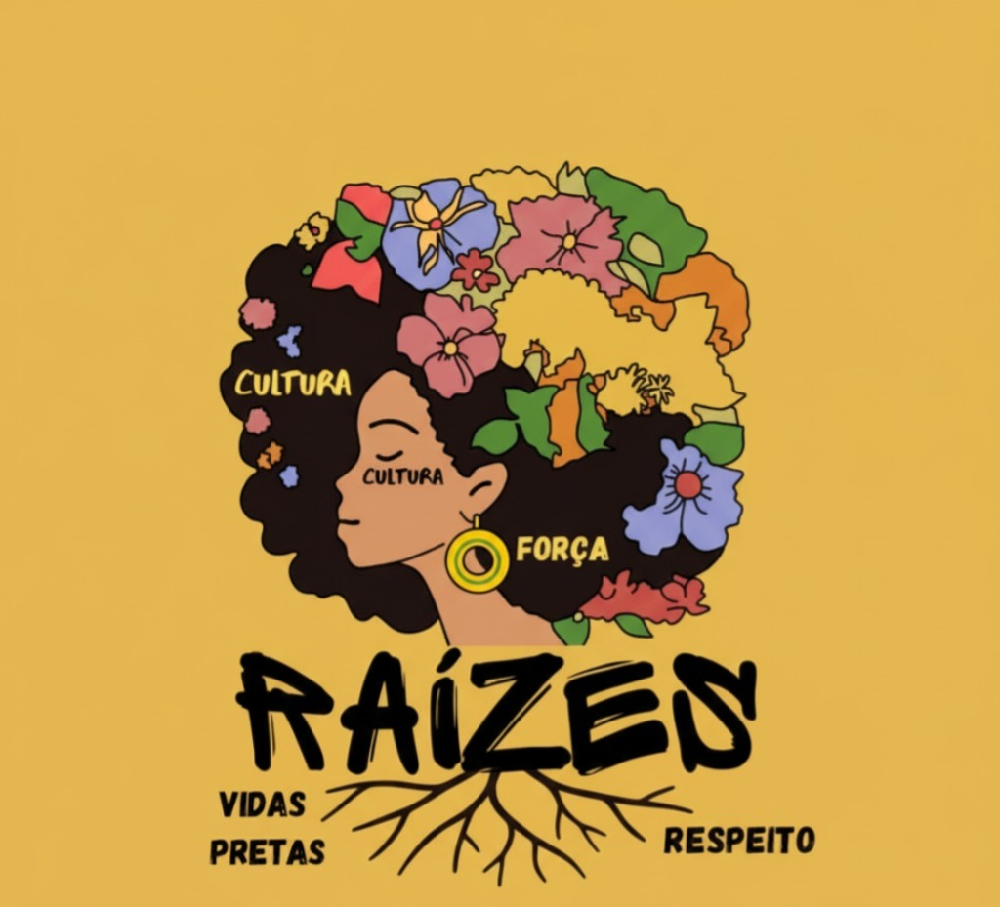

---

# **RELEASE OFICIAL — SEMANA DA CONSCIÊNCIA RACIAL**

# **SENAC Pernambuco fortalece identidade e ancestralidade com projeto Vivências e Raízes durante a Semana da Consciência Racial (24 a 28 de novembro)**

O SENAC Pernambuco realiza, entre os dias **24 e 28 de novembro de 2025**, a programação oficial da Semana da Consciência Racial por meio do projeto **Vivências e Raízes – Identificação e Reconhecimento Racial**, uma iniciativa contínua criada por estudantes, instrutores e pela coordenação pedagógica da instituição (SENAC Pernambuco). O projeto surgiu com o propósito de **promover diálogos sobre identidade racial, ancestralidade, pertencimento e combate ao racismo estrutural**, unindo tecnologia, arte, cultura e experiências educativas transformadoras.

Diferente de um evento isolado, o **Vivências e Raízes** é uma plataforma viva, baseada em ferramentas digitais, gamificação, vivências coletivas e criações culturais desenvolvidas pelos próprios alunos. Essa metodologia inovadora reforça o compromisso do SENAC Pernambuco em oferecer uma educação **plural, antirracista, inclusiva e alinhada à Agenda 2030**, especialmente aos ODS 4 (Educação de Qualidade), ODS 10 (Redução das Desigualdades) e ODS 16 (Paz, Justiça e Instituições Eficazes).

Durante toda a semana, o público poderá participar de oficinas, rodas de conversa, apresentações culturais, batalhas de rap, rodas de capoeira, poesia, música, exposições e práticas inspiradas nas tradições africanas e afro-brasileiras. A programação foi inteiramente construída com **protagonismo estudantil**, buscando fortalecer o reconhecimento e a valorização da diversidade racial presente na sociedade brasileira.

Além das atividades presenciais, o projeto também apresenta sua **identidade visual própria**, criada pelos alunos e inspirada nas raízes africanas, nos símbolos de resistência e nas memórias ancestrais que moldam a cultura brasileira.

---

# **PROGRAMAÇÃO – 24 A 28 DE NOVEMBRO**

### **24 de novembro (segunda-feira)**

**• 08h às 22h – ExploraRaízes – combina gamificação com exploração de identidade e diversidade.**

**• 13h às 14h / 17h às 18h – Musicalidade**

**• 13h às 14h – Expressão Cultural: Canto, Dança e Recital**

**• 17h às 18h – Palestra “Falas Pretas: Comunicação Inclusiva em Espaços Digitais”**

**• 13h às 14h / 17h às 18h – Microfone Aberto**

**• 13h às 22h – Exposição do Mural Cultural Educativo**

---

### **25 de novembro (terça-feira)**

**• 08h às 22h – ExploraRaízes – combina gamificação com exploração de identidade e diversidade.**

**• 08h às 22h – Exposição do Mural Cultural Educativo**

**• 11h às 12h – Programação Musical: Identificação, Reconhecimento e Resistências**

**• 13h às 14h / 17h às 18h – Batalha de Rap**

**• 13h às 14h – Oficina de Turbantes**

**• 13h às 14h / 17h às 18h – Microfone Aberto**

**• 17h às 18h – Oficina de Escritas Urbanas**

---

### **26 de novembro (quarta-feira)**

**• 08h às 22h – ExploraRaízes – combina gamificação com exploração de identidade e diversidade.**

**• 08h às 22h – Exposição do Mural Cultural Educativo**

**• 11h às 12h – Programação Musical: Identificação, Reconhecimento e Resistências**

**• 13h às 14h – Roda de Capoeira**

**• 13h às 14h / 17h às 18h – Roda de Conversa: Consciência Negra**

**• 13h às 14h / 17h às 18h – Microfone Aberto**

---

### **27 de novembro (quinta-feira)**

**• 08h às 22h – ExploraRaízes – combina gamificação com exploração de identidade e diversidade.**

**• 08h às 22h – Exposição do Mural Cultural Educativo**

**• 11h às 12h – Programação Musical: Identificação, Reconhecimento e Resistências**

**• 13h às 14h / 17h às 18h – Oficina de Ervas: Religiões de Matriz Africana**

**• 13h às 14h / 17h às 18h – Oficina de Discotecagem Básica**

**• 13h às 14h / 17h às 18h – Microfone Aberto**

---

### **28 de novembro (sexta-feira)**

**• 08h às 22h – ExploraRaízes – combina gamificação com exploração de identidade e diversidade.**

**• 08h às 22h – Exposição do Mural Cultural Educativo**

**• 11h às 12h – Programação Musical: Identificação, Reconhecimento e Resistências**

**• 13h às 14h – Musicalidade**

**• 13h às 14h / 17h às 18h – Microfone Aberto**

**• 17h às 18h – Roda de Coco**

**• 17h às 18h – Recital de Poesias**

---

# **Informações para a Imprensa**

**Instituição:** SENAC Pernambuco

**Projeto:** Plataforma e Vivências Raízes – Semana da Consciência Racial

**Período:** 24 a 28 de novembro de 2025

**Local:** Av. Visconde de Suassuna, 500 – Santo Amaro

**Acesso:** Evento gratuito e aberto ao público

**Contato institucional:** (81) 988033826 (Instrutor Elvio Luiz) / (81) 988879611 (Coordenadora Mere Coutinho), (81) 988037501 (Estudante)

---